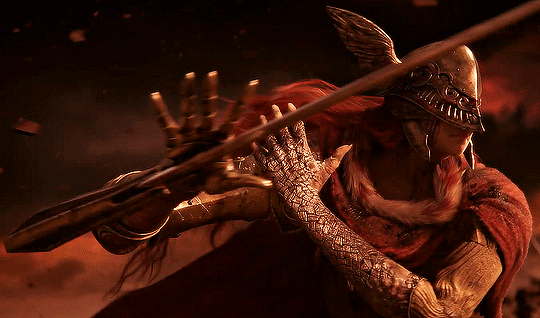
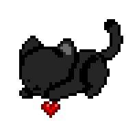
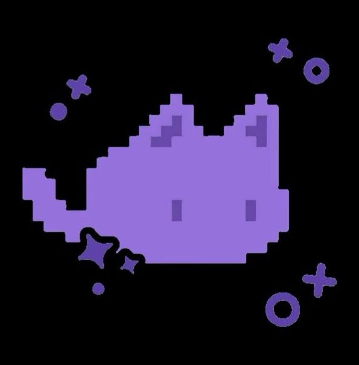

<!--- Banner -->

  

  

<!--- About me -->
### Sobre mim

Sou estudante de **Desenvolvimento de Software Multiplataforma (DSM)** na Fatec Jacareí.  
Curto criar interfaces bonitas e interativas — tenho um interesse forte em **Frontend e design de UI**.  
Estou sempre buscando aprender mais sobre **desenvolvimento web**, **bancos de dados** e boas práticas de **design**.
Tenho conhecimento em `HTML`, `CSS`, `JavaScript`, `Typescript`, `Node.js`, `Postgresql`, `React`, `Vite`, `Tailwind CSS`, `Figma` e `UX/UI Design`, e atualmente estou estudando **Python** e **MongoDB**.

 

--- 

<!--- My stacks -->

### Tecnologias que uso

  
  
  
  
  
  
  
   
  
  
  

### Tools

  
  
  

### Em aprendizado

  
  

--- 

    
### Um pouco mais sobre mim! 
Fora do código, sou apaixonada por **gatos**, **livros**, **arte** e um bom **café**. Curto muito **jogos de história** e **mundo aberto**, e sou viciada em `Overwatch`. Também sou super fã do `universo do George R. R. Martin`!!  
Estou sempre em constante aprendizado, buscando evoluir tanto na `programação` quanto no `design`!

**Fale comigo:**

  
  
  

    

---

<!-- Pacman -->
<picture>
  <source media="(prefers-color-scheme: dark)" srcset="https://raw.githubusercontent.com/eloahsousaa/eloahsousaa/output/pacman-contribution-graph-dark.svg">
  <source media="(prefers-color-scheme: light)" srcset="https://raw.githubusercontent.com/eloahsousaa/eloahsousaa/output/pacman-contribution-graph.svg">
  
</picture>

---
